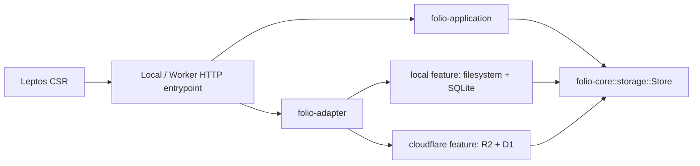

# Architecture

## Runtime

Leptos CSR runs in browser WASM. Rust HTTP entrypoints serve one shared JSON application. Cloudflare Static Assets serve HTML, CSS, JS and browser WASM without invoking application code; only `/api` and `/api/*` run the Worker.

- `core`: serializable contracts, validation, task parsing and an asynchronous storage port.
- `application`: authentication and product behavior. It owns SQL statements and has no Cloudflare/browser dependency.
- `storage-local`: SQLite migrations/transactions, path validation and atomic file replacement.
- `storage-cloudflare`: D1 prepared statements/transactions, R2 reads and conditional writes.
- `adapter`: optional implementation dependencies selected through `local` / `cloudflare` features. `RuntimeStore` resolves to the matching target implementation.
- `local`: Axum/Tokio. A mutex serializes local storage; blocking work runs outside the async executor.
- `worker`: request-size/content-type/security response handling and Workers bindings.
- `web`: reusable Leptos components, page state, fetch, editor lifecycle and themes.

## Canonical storage

The vault path is authoritative: local `vault/Projects/Folio/Design.md` corresponds to R2 `notes/Projects/Folio/Design.md`. New Markdown files contain only the editor body. Folder location is never written into Markdown. Native storage uses real directories; R2 uses key prefixes and `.folio-folder` marker objects for empty directories. Native markers preserve the same portable export format, while externally created empty native directories are also discovered.

`.folio/` holds optional note identity records (`notes/<hash-of-id>.json`), resumable move journals (`moves/<hash-of-id>.json`), the pending folder rename, format version, and primary standalone tasks/goals (`tasks/<id>.json`, `goals/<id>.json`). This directory is excluded from normal note exploration. It is not a second source of folder paths for Markdown discovery.

A file without a note identity record is opened using a reversible, URL-safe path handle. Losing identity records can change note/task IDs, but does not hide the files or change their contents. Existing identity records keep open note URLs stable across application-controlled moves. An external rename may change identity; rebuilding discovers the new path and removes stale search entries. User paths reject traversal, absolute paths, reserved Windows names, trailing dots and hidden folders. Native storage rejects symlinks/reparse points and does not traverse them.

D1/SQLite retain derived titles, previews, search text, folder paths, revisions and task indexes. Standalone task/goal originals are JSON files. Authentication/session/rate-limit data and mutation leases remain SQL-owned: SQL is not entirely disposable. A lost index can be recreated; loss of the whole database requires schema migration and account/session recovery before authenticated access. A database outage is not an offline authentication bypass.

## Read and save paths

- Browse: paginated storage **key metadata** listing, with cached titles/previews when present; no Markdown-body scan. Folder ancestry comes from paths. Current flat-tree UI collects key pages before its 50-note result page; very large vaults may need a lazy directory API later.
- Search/planner: bounded SQL queries. Rebuild restores these indexes from files in bounded requests; search can be incomplete until rebuilding finishes.
- Open: resolve the optional identity record or path handle, then read the Markdown. Legacy ID lookup is supported during migration.
- Save: validate, take short SQL leases, check the canonical revision, conditionally write the original, then update derived indexes. Index failure preserves the original and the editor draft.
- Rename/move: save a recovery journal, create the destination without overwriting another file, verify its bytes, update identity, verify the old source is unchanged and remove it, then remove the journal. Both environments use this protocol, including native mode, so recovery behavior agrees. A retry resumes an unfinished move.
- Folder rename: a persistent journal and bounded note batches, followed by moving empty-folder markers. The operation can resume after a partial failure. Source files are discovered from storage even if their SQL rows are missing.

Existing destination names, including case-folded matches for cross-runtime portability, produce a conflict. Legacy migration uses a deterministic suffix when titles collide, without changing note bodies. R2 has no conditional delete primitive here; the lease serializes Folio writers, but does not lock direct filesystem/S3 clients. Do not concurrently edit a source through external tools while Folio moves/deletes it. Detected source edits leave both copies intact.

Native writes use a same-directory temporary file and fsync; create-only writes use no-clobber persistence. R2 writes use ETag conditions. There is no transaction spanning canonical files and SQL. Retrying Save or rebuilding repairs derived data after an index failure.

### Migration and rebuilding

Settings exposes **Migrate existing files** and **Rebuild from files**, using authenticated, CSRF-protected API requests. Native operators can also use `folio-local --migrate-storage` and `folio-local --rebuild-index` with the server stopped.

Migration copies and verifies old `vault/<id>.md` / R2 `notes/<id>.md` originals into `.folio/legacy/`, converts the old reserved folder comment to an actual path, and removes the comment from the active Markdown. It exports existing standalone tasks/goals and preserves empty folders. Existing IDs remain usable. Rerunning is safe; migration stops on a conflicting backup or destination rather than overwriting it.

Rebuild reads at most two listed storage entries per request, restores available note identities, search/checkbox indexes and standalone planner records, then prunes missing indexed files in bounded SQL pages. Malformed auxiliary records are reported individually and do not prevent later Markdown recovery. SQL-only legacy planner rows are preserved until migration finishes. Browser maintenance reports skipped records. The operation can be restarted safely; the CLI returns an error when any records were skipped.

## Markdown task identity

Unordered Markdown checkboxes outside fenced code blocks are indexed. Tasks keep identity by matching title and occurrence; line position is a fallback for an edited title only when it cannot steal another existing title's identity. Identical duplicate titles are matched in document order.

Source task edits write back through the note save pipeline. Due dates/times use portable `@due(YYYY-MM-DD)` and `@time(HH:MM)` suffixes. A changed/missing source line is rejected rather than editing an unrelated checkbox. Archiving a note removes its derived tasks; restoring it reindexes them. Removing a source task is done by editing its Markdown.

Checkbox indexing inserts a JSON array through SQLite/D1 `json_each`, rather than issuing a statement for every checkbox. A note supports at most 2,000 indexed checkboxes.

## Authentication and security

Both runtimes require authentication. Local uses passwords; production Cloudflare uses Access. There is no anonymous development override.

- Local/password mode: one account; Argon2id v19 (19 MiB, t=2, p=1), encoded salt/parameters/hash. Legacy PBKDF2-SHA256 hashes upgrade only after a successful login.
- Five-minute Access JWTs authorize requests without session-table reads. One-week Refresh Tokens are stored only as SHA-256 digests and rotated atomically on refresh.
- HttpOnly, SameSite=Strict cookies; Secure on HTTPS.
- CSRF tokens on authenticated mutations and same-origin checks when Origin is supplied.
- JSON-only writes, bounded request bodies, validated IDs/folders/dates, parameterized SQL.
- Ten login attempts per client per fifteen-minute window; successful login resets its counter.
- Password-mode Worker first setup requires a configured `FOLIO_SETUP_TOKEN` of at least 24 characters. Existing accounts cannot be replaced through setup.
- Markdown raw HTML is excluded; preview HTML is sanitized, including unsafe link schemes.

The Worker JavaScript entrypoint verifies Cloudflare Access RS256 assertions with jose/Web Crypto before calling Rust. It checks issuer, AUD, expiry and the exact email allowlist, caches public keys, and overwrites an internal identity binding. The shared Rust application exchanges local Argon2id login or this verified identity for a five-minute Access JWT and a one-week Refresh Token. Business requests validate JWT signatures and CSRF without session DB reads; refresh atomically validates and rotates the stored token digest. Production binds app JWT subjects to the verified Access identity. See [authentication implementation](AUTH_OPTIONS.md).

Password mode remains available for local Wrangler emulation. Production configuration selects Access without password fallback and without a Paid CPU override. Verify real CPU after deployment; see [deployment](DEPLOYMENT.md). Native mode binds loopback and permits the documented Trunk loopback proxy.

## Client state

Notes debounce saves by approximately three seconds; blur, note/page navigation and Ctrl/Cmd+S flush. A failed save blocks destructive navigation and preserves both the editor and a local browser draft. The recovered draft retains its base revision. Saving as a new note is available for conflict recovery.

In-flight saves temporarily disable editor mutation. Successful saves update list metadata from the response. No polling or per-keystroke API saves. Quick Note preserves its capture text while navigating and in browser storage. Explicit sign-out asks to save or discard a pending Quick Note, with Cancel available. Sign-out verifies browser draft removal; save or cleanup failures keep the user signed in with their text preserved.

The browser keeps the local calendar day in reactive state. Focus, visibility changes and page restoration check it immediately; a 30-second local timer handles a tab left open across midnight. Checks on the same day make no network requests. A changed day refreshes Home/Todo filters and default due dates, and moves the planner only when it was following today. Explicitly chosen dates and drafts remain intact. Daily Note uses one local-date snapshot for its ID and title.

Search debounces SQL requests and ignores stale results. Notes use 50-item pages; tasks use 200-item pages with group/date filtering. Theme state applies before paint, follows system initially, and persists an explicit override.

## API

Business data endpoints require a Folio Access JWT; their mutations and logout also require `X-CSRF-Token`. Health and auth status do not require a Folio JWT. Password setup/login issue tokens; refresh uses the refresh cookie and requires an explicit same-origin `Origin`, without a current JWT or CSRF header. Production Cloudflare Access protection still applies to the entire hostname, including these routes.

| Method | Path | Behavior |
| --- | --- | --- |
| GET | /api/health | Runtime health without storage access |
| GET | /api/auth/status | Setup/session status |
| POST | /api/auth/setup | First password account; emulated Worker requires `X-Setup-Token`; unavailable in Access mode |
| POST | /api/auth/login | Issue Access/Refresh tokens |
| POST | /api/auth/refresh | Atomically rotate Refresh Token and issue Access JWT |
| POST | /api/auth/logout | Revoke refresh session and clear its cookie; issued JWTs expire within five minutes |
| GET | /api/workspace | Initial bounded workspace data |
| GET | /api/notes | `q`, `folder`, `exact`, `archived`, `offset`; items + next_offset |
| GET / PUT / DELETE | /api/notes/{id} | Stable ID or encoded path handle; open / save / revision-checked delete |
| POST | /api/storage/migrate | Bounded legacy conversion; pass returned `phase` / `after` |
| POST | /api/storage/rebuild | Bounded reconstruction; pass returned `cursor` / `phase` / `after` |
| GET / POST / PUT / DELETE | /api/folders | List / create / resumable rename / remove empty hierarchy |
| GET | /api/folders/rename | Pending hierarchy rename for recovery |
| GET | /api/tasks | `group` + `today`, or `from`/`to`, and `offset` |
| POST | /api/tasks | Create standalone task |
| PUT / DELETE | /api/tasks/{id} | Edit standalone or Markdown-source task / delete standalone task only |
| GET / POST | /api/goals | List / create |
| PUT | /api/goals/{id} | Edit title/description/position/status |

Markdown bodies are limited to 128 KiB. JSON bodies allow escaping expansion and are separately bounded. Search queries are at most 200 bytes; folder paths at most 240 bytes. Search and planner queries do not scan canonical storage. File exploration lists paths without loading Markdown bodies.

Folder renames use a persistent operation record and a short shared mutation lease. Canonical folder changes run in bounded batches and can resume after failure. See [folder explorer](FOLDERS.md).

## Cloud latency

Workspace bootstrap reuses one canonical key listing for notes and folders. SQL leases use atomic INSERT/UPDATE RETURNING to avoid a separate owner read. Cloudflare responses expose aggregate `Server-Timing` for Access, application, D1 and R2 operations; timing logs exclude SQL, object names, tokens and user content. Optional production placement hints run the Worker near known storage; otherwise Smart Placement is used.
